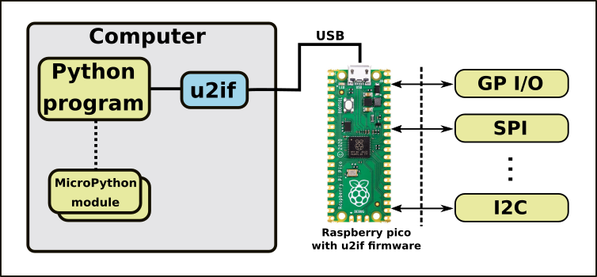
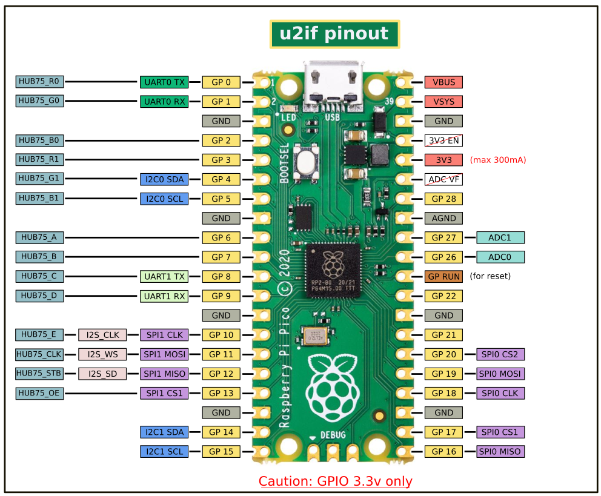

# u2if project

u2if(USB to interfaces) is an attempt to implement some of the MicroPython "machine" module functionalities on a computer.
The goal is to be able to communicate with breakout boards (sensors, lcd...) simply from a python program on x86 machine. It uses a Raspberry PICO (or other RP2040 based board) to make the interface between the computer (USB) and peripherals/protocols.

<p align="center"></p>

**Python led swith on/off**:
```python
import time
from machine import u2if, Pin

# Initialize GPIO to output and set the value HIGH
led = Pin(u2if.GP3, Pin.OUT, value=Pin.HIGH)
time.sleep(1)
# Switch off the led
led.value(Pin.LOW)
```

## Caution

It is in experimental state and not everything has been tested. Use with caution. It is supposed to work on windows, linux and Mac.
To work in Linux in non-root, an udev rules has to be added (See [Firmware readme](firmware/README.md)).


## Why this project ?
When I want to retrieve values from a sensor or even to play with a led or a button from the PC, I make an arduino program that communicate to the PC via the serial port. That umplies to define a serial "protocol" between the PC and the arduino and it is not necessarily reusable because it is specific. I find it interesting to implement a majority of the functionalities of the MicroPython machine module and add other protocols.

Solutions already exist, for example [Adafruit Blinka](https://github.com/adafruit/Adafruit_Blinka) from Adafruit via the FT2232H in CircuitPython or pyftdi in Python with the same IC.
Note: now, firmware part can be also used with Adafruit Blinka ! 


## Implemented Interfaces
The following features are coded:

* machine.Pin: input (+irq, +debounced), output (+pull down/up) and grouped pins.
* machine.Signal
* machine.ADC: read (12bits)
* machine.UART
* machine.I2C
* machine.SPI
* machine.PWM
* I2S
* WS2812B led (https://youtu.be/WCGI4C6nZ-o)
* HUB75 (https://youtu.be/qRShI9y964Q)


## Licenses and Project directories
This repository is presented as the sources of a python project ([License](source/LICENSE)).
But it also contains the following projects:

 * [firmware](firmware/): PICO firmware, binary and C++ source [License](firmware/source/LICENSE).
 * [examples](examples/): Python program examples.
 * [board](board/): Example of a pico headers board for this project  ([License](firmware/source/LICENSE)).


## How to use it

### Upload firmware
See [Firmware README](firmware/README.md)

### Install u2if python package

Install python package from release file (u2if-*.*.tar.gz) with python3 -m pip install dist/u2if-*.*.tar.gz

## Build u2if python package

To build package if wanted :

 * If needed, install build: python3 -m pip install --upgrade build
 * Build it: python3 -m build


### Examples

There is no documentation but [examples](examples/) can help to use this library :

 * Led On/Off
 * Switch with or whithour irq and debouncing
 * PWM controlling servo-motor
 * Display testing: SSD1306 (I2C and SPI), GC9A01 (round lcd)
 * Some sensors simple test: MPU9250 (IMU), VL53L0X (range), BMP280(Temp)
 * UART read/Write
 * Analog read.
 * Rotrary encoder
 * I2C scan
 * Play 48khz 16bit .wav over I2S DAC (PAM5102)
 * ...


## u2if boards/pinout

For simplicity, the pins of the SPI, I2C and UART devices have been fixed. If a peripheral is not used, its pins can be used as a classic I/O. Here are the compatibles boards.

### PICO
<details>
<p align="center"></p>

Implemented interfaces:
 - GPIO
 - ADC
 - PWM
 - UART0 & UART1
 - I2C0 & I2C1
 - SPI0 & SPI1
 - WS2812B
 - I2S

</details>

### Adafruit Feather RP2040
<details>

Implemented interfaces:
 - GPIO
 - ADC
 - PWM
 - UART0
 - I2C0 & I2C1
 - SPI0 & SPI1
 - WS2812B

</details>

### Adafruit Qt Py RP2040
<details>

Implemented interfaces:
 - GPIO
 - ADC
 - PWM
 - UART1
 - I2C0 & I2C1
 - SPI0
 - WS2812B

</details>

### Adafruit ItsyBitsy RP2040
<details>

Implemented interfaces:
 - GPIO
 - ADC
 - PWM
 - UART0
 - I2C1
 - SPI0 & SPI1
 - WS2812B

</details>

### Adafruit Trinkey QT2040
<details>

Implemented interfaces:
 - GPIO
 - ADC
 - PWM
 - UART0
 - I2C0 & I2C1
 - SPI0 & SPI1
 - WS2812B

</details>


## Troubleshooting
### Import error using MicroPython module
#### import ustruct

The ustruct module is belongs by micropython. There is a micropython-cpython-ustruct compatibility module, but it doesn't seem to work for me. If necessary modify:
```python
import ustruct
```
to:
```python
import struct as ustruct
```

#### import utime & const

Install micropython-cpython-utime and micropython-cpython-micropython.


