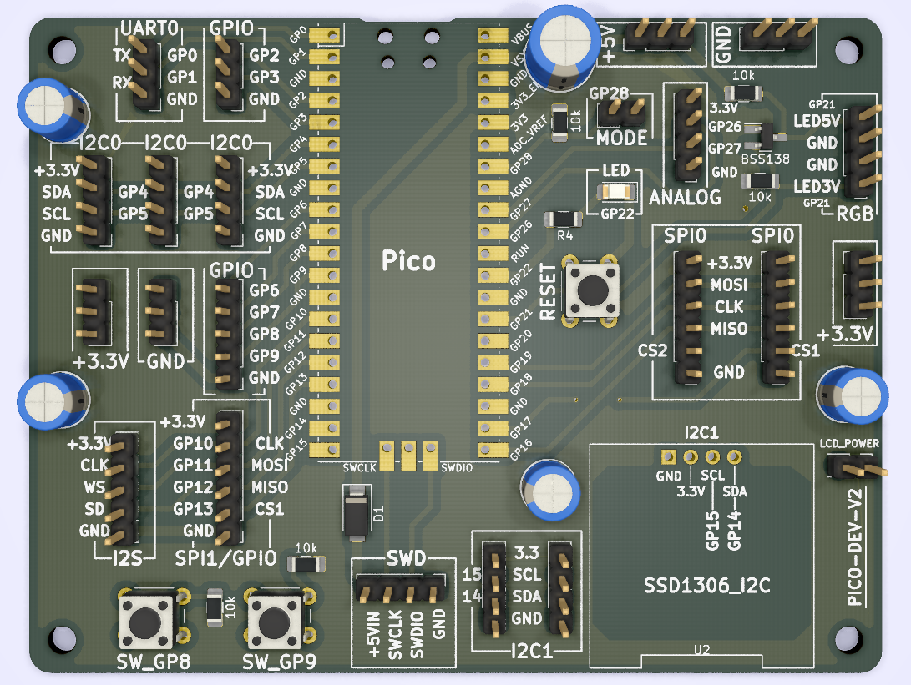
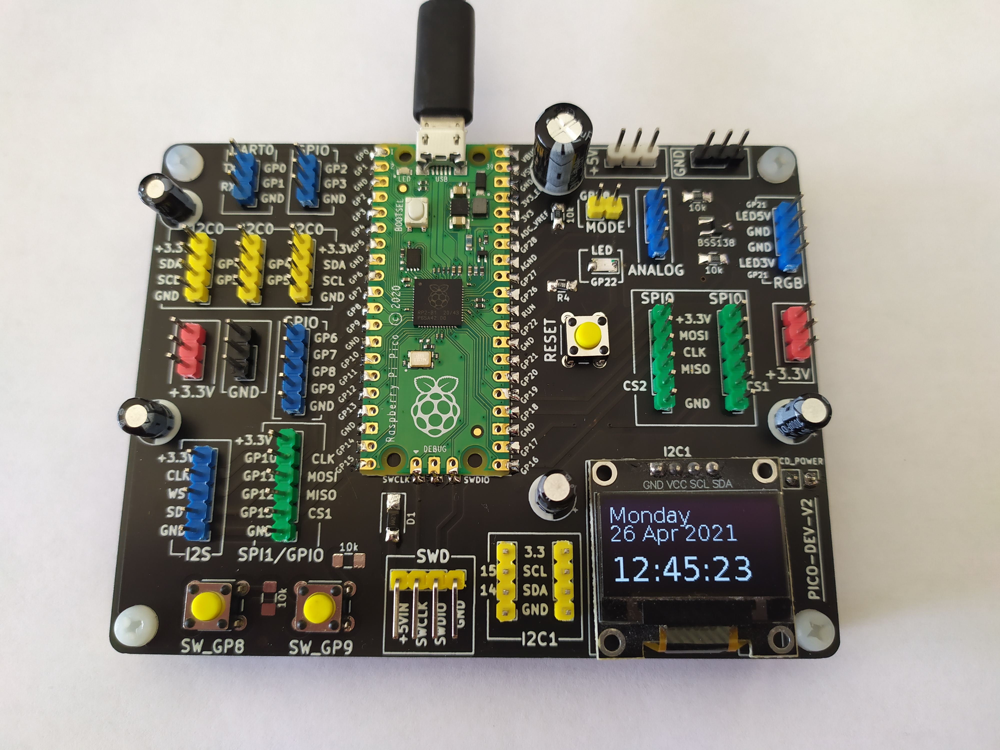
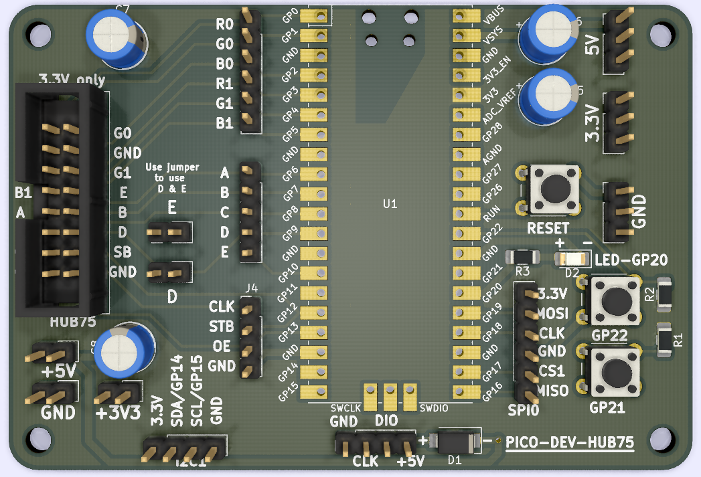

# PICO headers dev board

There are some kicad projects of a PCB with some I/O but mostly headers.
**Caution**: I am not an electronic engineer, check schematics and PCB before using it !

## pico-dev-v2
Dev. board with headers.

Zipped gerber file is available: [Gerber file](pico-dev/gerber/pico-dev-v2.zip)

## pico-dev-hub75
Dev. board with hub75 connector. Caution, there is no level translator (3.3v -> 5V), so it may not work with some leds matrix because of they work on 5V logic level.

There are two jumpers to wire D and E signal in case of 1/16 and 1/32 panels.

Zipped gerber file is available: [Gerber file](pico-hub75/gerber/pico-hub75.zip)

